# Overview

> **Repository:** [github.com/NVIDIA/TensorRT-Edge-LLM](https://github.com/NVIDIA/TensorRT-Edge-LLM)

## What is TensorRT Edge-LLM?

TensorRT Edge-LLM is NVIDIA's high-performance C++ inference runtime for Large Language Models (LLMs) and Vision-Language Models (VLMs) on embedded platforms. It enables efficient deployment of state-of-the-art language models on resource-constrained devices such as NVIDIA Jetson and NVIDIA DRIVE platforms.

## Supported Platforms

### Hardware Platforms

**Officially Supported Platforms:**

| Platform | Software Release | Link |
|----------|------------------|------|
| NVIDIA Jetson Thor | JetPack 7.1 | [JetPack Website](https://developer.nvidia.com/embedded/jetpack) |
| NVIDIA DRIVE Thor | NVIDIA DriveOS 7 | [NVIDIA DRIVE Developer](https://developer.nvidia.com/drive) |

> **Note:** The platforms listed above are officially supported and tested. While TensorRT Edge-LLM may run on other NVIDIA GPU platforms (for example, discrete GPUs, other Jetson devices), these are not officially supported but may be used for experimental purposes.

**Compatible Platforms:**

| Platform | Software Release |
|----------|------------------|
| NVIDIA Jetson Orin | JetPack 6.2.x |

> **Note:** TensorRT Edge-LLM will officially support Jetson Orin via later JetPack releases. While JetPack 6.2.x is compatible, the support is experimental. 

### Supported Model Families

TensorRT Edge-LLM supports a wide range of state-of-the-art models:
- **Large Language Models**: Llama 3.x, Qwen 2/2.5/3, DeepSeek-R1 Distilled
- **Vision-Language Models**: Qwen2/2.5/3-VL, InternVL3-1B-hf, InternVL3-2B-hf, Phi-4-Multimodal
- **Quantization**: FP16, FP8 (SM89+), INT4 AWQ/GPTQ, NVFP4 (SM100+)

For the complete list of supported models, precision requirements, and platform compatibility, see **[Supported Models](user_guide/getting_started/supported-models.md)**.

---

## Key Features

- **🚀 High Performance**: Optimized CUDA kernels and TensorRT integration for minimum latency
- **💾 Memory Efficient**: Supporting 4-bit quantization for reduced memory footprint, with [FP8 KV cache](user_guide/features/FP8KV.md) support for additional memory savings
- **🔄 Production Ready**: C++-only runtime with no Python dependencies, designed for deployment on edge devices
- **🎯 Edge Optimized**: Built specifically for NVIDIA Jetson and DRIVE platforms with platform-specific optimizations
- **🔧 Rich Feature Set**: Supports [LoRA adapters](user_guide/features/lora.md), EAGLE3 speculative decoding, [system prompt caching](user_guide/features/system-prompt-cache.md), [vocabulary reduction](user_guide/features/reduce-vocab.md), and vision-language models
- **📊 Complete Toolkit**: End-to-end workflow from Python export pipeline to C++ runtime, with engine builder and examples

## Key Components

> **Code Location:** `tensorrt_edgellm/` (Python), `cpp/` (C++), `examples/` (Examples)

TensorRT Edge-LLM uses a three-stage pipeline:

```mermaid
%%{init: {'theme':'neutral', 'themeVariables': {'primaryColor':'#76B900','primaryTextColor':'#fff','primaryBorderColor':'#5a8f00','lineColor':'#666','edgeLabelBackground':'#ffffff','labelTextColor':'#000','clusterBkg':'#ffffff','clusterBorder':'#999'}}}%%

graph LR
    HF_MODEL[Autoregressive Models<br>*such as HuggingFace*]
    PYTHON_EXPORT(Python Export Pipeline)
    ONNX_MODEL[ONNX<br>Model]
    ENGINE_BUILDER(Engine Builder)
    TRT_ENGINE[TensorRT<br>Engines]
    CPP_RUNTIME(C++ Runtime)
    SAMPLES(Examples)
    APPLICATIONS(Applications)

    HF_MODEL --> PYTHON_EXPORT
    PYTHON_EXPORT --> ONNX_MODEL
    ONNX_MODEL --> ENGINE_BUILDER
    ENGINE_BUILDER --> TRT_ENGINE
    TRT_ENGINE --> CPP_RUNTIME
    CPP_RUNTIME --> SAMPLES
    SAMPLES --> APPLICATIONS

    classDef greyNode fill:#f5f5f5,stroke:#999,stroke-width:1px,color:#333
    classDef nvNode fill:#76B900,stroke:#5a8f00,stroke-width:1px,color:#fff
    classDef darkNode fill:#ffffff,stroke:#999,stroke-width:1px,color:#333
    classDef inputNode fill:#f5f5f5,stroke:#999,stroke-width:1px,color:#333
    classDef itemNode fill:#ffffff,stroke:#999,stroke-width:1px,color:#333

    class HF_MODEL inputNode
    class ONNX_MODEL,TRT_ENGINE itemNode
    class PYTHON_EXPORT,ENGINE_BUILDER,CPP_RUNTIME nvNode
    class APPLICATIONS darkNode
    class SAMPLES nvNode
```

| Component | Description |
|-----------|-------------|
| **Python Export Pipeline** | Python-based toolchain that converts HuggingFace models into ONNX format with quantization (FP8, INT4, NVFP4). [Learn More](developer_guide/software-design/python-export-pipeline.md) |
| **Engine Builder** | C++-based application that compiles ONNX models into optimized TensorRT engines. [Learn More](developer_guide/software-design/engine-builder.md) |
| **C++ Runtime** | C++-based runtime that executes TensorRT engines with CUDA graphs, LoRA, and EAGLE support. [Learn More](developer_guide/software-design/cpp-runtime-overview.md) |
| **Examples** | Reference implementations demonstrating LLM, multimodal, and utility use cases. See the [Quick Start Guide](user_guide/getting_started/quick-start-guide.md) and example guides in the User Guide. |

---

## Next Steps

Ready to get started with TensorRT Edge-LLM? Follow these steps:

1. **[Installation Guide](user_guide/getting_started/installation.md)** - Set up the Python export pipeline on your x86 host and build the C++ runtime on your edge device

2. **[Quick Start Guide](user_guide/getting_started/quick-start-guide.md)** - Run your first LLM inference in ~15 minutes with step-by-step instructions

3. **Examples** - Explore advanced workflows including [VLM inference](user_guide/examples/vlm.md), [speculative decoding](user_guide/examples/speculative-decoding.md), [ASR](user_guide/examples/asr.md), [MoE](user_guide/examples/moe.md), and [TTS](user_guide/examples/tts.md)

---

**For questions or issues, visit our [TensorRT Edge-LLM GitHub repository](https://github.com/NVIDIA/TensorRT-Edge-LLM).**
